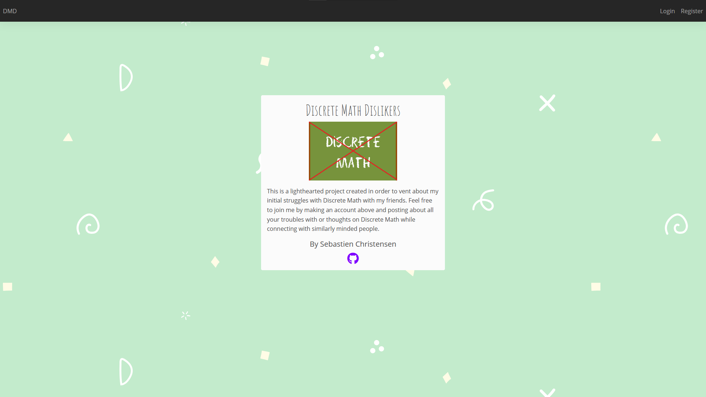

# Discrete Math Dislikers #

This is a social media website that I made to complain about Discrete Math topics and classes with my friends. Feel free to make an account and join the discussion!

### Backend ###

This project uses Web.py as well as MongoDB for the backend. Most of the routing and functions can be found in the Models folder as well as in controller.py. I utilize libraries like pymongo, dnspython, and bcrypt in order to effectively and securely store information. Web.py allows me to easily inject the templates and import data from pymongo into the site. It handles login, registration, sessions, retreiving/creating posts, updating settings on each user and much more.

### Front End ###

This project uses the standard HTML/JS/CSS as well as some other common libraries like JQuery for handling actions and Bootstrap for clean and efficient design. The front end was not the main objective of this project, however as it came along I was able to slowly grow my skills to make it cleaner than I thought it would. The website has many different pages such as login, registration, discover feed, profile, and more. These pages are generated with a main layout html file which has each respective page injected into it as part of web.py's functionality.
