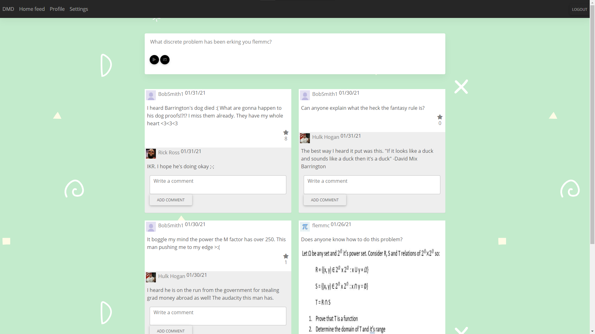

# Discrete Math Dislikers #

This is a social media website that I made to complain about Discrete Math topics and classes with my friends. Users can create accounts, login, make posts, upload images, make comments, and interact with a wide community of people who don't enjoy Discrete Math too much. My main goal with this project was to reinforce my learning and understanding of python while also working on skills critical to backend development as well as front end. In the future I hope to potentially rewrite this project in flask as well as redo certain aspects of the code to optimize them and make a few small touches to the front end layout. However, I am satisfied with how it came out and am proud of what I was able to achieve.

### Backend ###

This project uses Web.py as well as MongoDB for the backend. Most of the routing and functions can be found in the Models folder as well as in controller.py. I utilize libraries like pymongo, dnspython, random, and bcrypt in order to effectively and securely store information. Web.py allows me to easily inject the templates and import data from pymongo into the site. It handles login, registration, sessions, retreiving/creating posts, updating settings on each user and much more. My MongoDB is hosted on AWS and allows me to store the credentials in the cloud rather than locally on my own machine. I used GridFS in order to store images and profile pictures on Mongo.

### Front End ###

This project uses standard HTML/JS/CSS as well as some other common libraries like JQuery/Ajax for handling actions and Bootstrap for clean and efficient design. The front end was not the main objective of this project, however as it came along I was able to slowly grow my skills to make it cleaner than I thought it would. The website has many different pages such as home post feed, login, registration, profile, and more that users can interact with. These pages are generated with a main layout html file which has each respective page injected into it as part of web.py's functionality. Through web.py and the render object, I can customize these pages to the specific user who is logged in and maintain that the website workflow is secure and works as intended. The ajax functions within my scripts allow me to communicate with my web.py backend and were really useful for ensuring all my buttons had functionality. I used id's for each post to be able to identify them and procedurally generate the appropriate post buttons and respective button handlers. 
